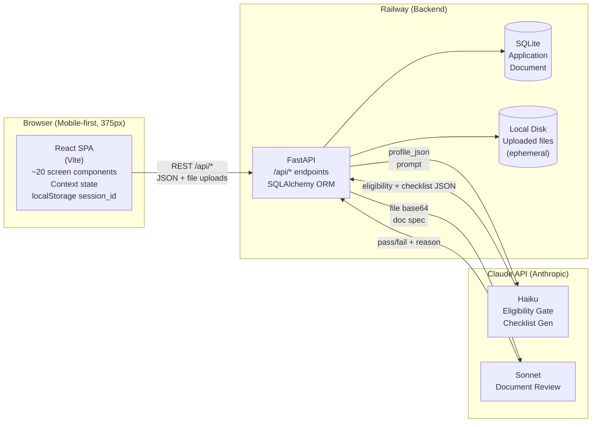

## Architectural Decisions

**AD-1: Design paradigm — Client-Server SPA**
- Binds: React SPA calls FastAPI REST backend. No SSR. No client-side router persistence between sessions.
- Prevents: mixing frontend/backend concerns, SSR complexity, multi-framework fragmentation.
- Rule: Frontend renders UI; backend owns all logic, data, and AI calls.

**AD-2: Frontend — React + Vite**
- Binds: One component per screen (~20 screens = ~20 components). React Context for session state. No Redux.
- Prevents: Redux overhead, monolithic component files, SSR tooling.
- Rule: If state crosses more than 2 components, lift to Context. Do not introduce a state library.

**AD-3: Backend — FastAPI (Python)**
- Binds: Existing project structure retained. REST API only. Endpoints under `/api/*`.
- Prevents: GraphQL, rewrite to another framework, breaking existing modules.
- Rule: Every new feature is a new router file in `api/routers/`. No logic in `main.py`.

**AD-4: Database — SQLite via SQLAlchemy**
- Binds: Two tables for v1.
  - `Application (id, session_id, destination, profile_json, eligibility_result, travel_dates, feasibility_ok, payment_status, submission_status, created_at)`
  - `Document (id, application_id, doc_type, file_path, review_status, review_notes)`
- Prevents: External DB dependency in demo, premature PostgreSQL migration.
- Rule: All queries go through SQLAlchemy ORM. No raw SQL in route handlers.

**AD-5: File storage — local disk for demo**
- Binds: Uploaded files stored to Railway ephemeral volume. `Document.file_path` holds relative path on disk.
- Prevents: S3/R2 dependency in v1, complex upload infrastructure.
- Rule: Storage layer is behind a single `storage.py` module. Production swap (Cloudflare R2) = replace that module only. Path reference pattern stays identical.

**AD-6: AI pipeline — two-stage, two models**
- Binds:
  - Stage 1 (Eligibility Gate + Document Checklist): Claude Haiku. Input: `profile_json`. Output: eligibility decision + checklist JSON. Deterministic, rule-based prompt.
  - Stage 2 (Document Review): Claude Sonnet. Input: uploaded file (base64 or Files API) + expected document spec. Output: `pass | fail | needs-clarification` + specific reason string.
- Prevents: Sonnet for cheap tasks (cost), Haiku for nuanced document reading (accuracy gap), frontend calling Claude directly.
- Rule: Model assignment is fixed per stage. Never swap models without updating this AD.

**AD-7: AI content policy — eligibility gate**
- Binds: Gate prompt must never state specific bank balance thresholds as embassy policy. Gate assesses: employment type, denial history, travel date feasibility, prior stamps.
- Prevents: Financial coaching, unofficial threshold disclosure (embassy rule violation).
- Rule: Any eligibility prompt change must be reviewed against FR-A4 in the PRD before deployment.

**AD-8: Authentication — none for demo**
- Binds: `session_id` generated on first page load, stored in `localStorage`, sent with every API call. No login flow.
- Prevents: Auth infrastructure complexity in demo phase.
- Rule: Backend treats `session_id` as the sole session identifier. Production: MoMo container provides `user_id`; replace `session_id` param with `momo_user_id` at that layer only.

**AD-9: Payment — placeholder for demo**
- Binds: Price screen shows service cost. "Thanh toán" button is non-functional in demo.
- Prevents: MoMo payment SDK integration complexity in v1.
- Rule: Payment button renders but dispatches no action. Production: replace with MoMo deeplink redirect.

**AD-10: Agency handoff — manual for demo**
- Binds: Operator reads SQLite directly and manually forwards documents to partner agency.
- Prevents: Admin dashboard, email integration, API handoff in v1.
- Rule: No automated handoff code in v1. Document this as a manual ops step in the runbook.

**AD-11: Deployment — Railway + Vercel**
- Binds: FastAPI backend → Railway ($5/month plan). React frontend → Vercel (free tier). No Docker.
- Prevents: DevOps complexity, container orchestration, self-hosted infrastructure.
- Rule: Railway deploys via `nixpacks` auto-detect. Vercel deploys via GitHub integration. No custom build scripts unless Railway/Vercel defaults fail.

**AD-12: Dependency direction — backend owns all AI calls**
- Binds: Frontend never calls Claude API. All AI interactions go through FastAPI `/api/*` routes. API keys live in Railway environment variables only.
- Prevents: API key exposure in browser, client-side AI calls, key leakage.
- Rule: If a screen needs AI output, it calls a backend endpoint. Period.

---

## Deferred (not decided in v1)

- Production database: PostgreSQL migration (SQLite → Postgres is an SQLAlchemy config change)
- Production file storage: Cloudflare R2 (swap `storage.py` module)
- Real payment: MoMo deeplink integration
- Admin dashboard for agency operator
- MoMo mini app SDK adaptation (MoMo team handles post-demo)
- Multi-language support (Vietnamese only in v1)
- Push notifications for status updates
- Embassy requirement monitoring automation (FR-E — manual in v1)
- Group/family compound profile assessment (FR-A8 — single applicant only in v1)

---

## System Diagram

---

## Build Order (suggested for solo builder)

1. DB schema + SQLAlchemy models (AD-4)
2. FastAPI skeleton with session_id middleware (AD-3, AD-8)
3. Eligibility gate endpoint + Haiku prompt (AD-6, AD-7)
4. React SPA scaffold + Context setup (AD-2)
5. Profile input screens → eligibility gate screen
6. Checklist generation endpoint + screen
7. File upload endpoint + disk storage (AD-5)
8. Document review endpoint + Sonnet integration (AD-6)
9. Document review screen + readiness score
10. Price screen with placeholder payment button (AD-9)
11. Submission confirmation screen
12. Deploy: Railway backend, Vercel frontend (AD-11)
